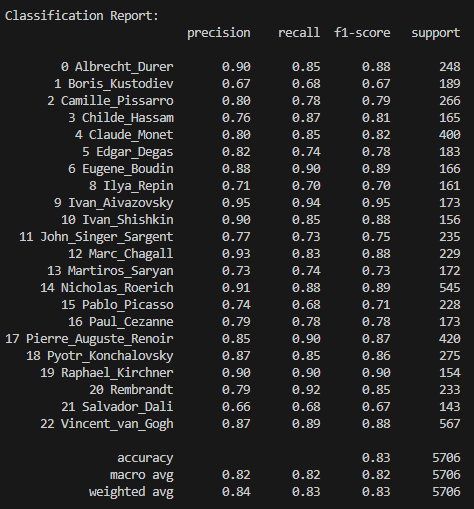
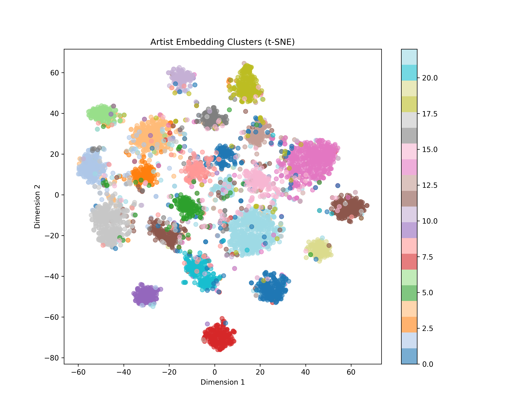
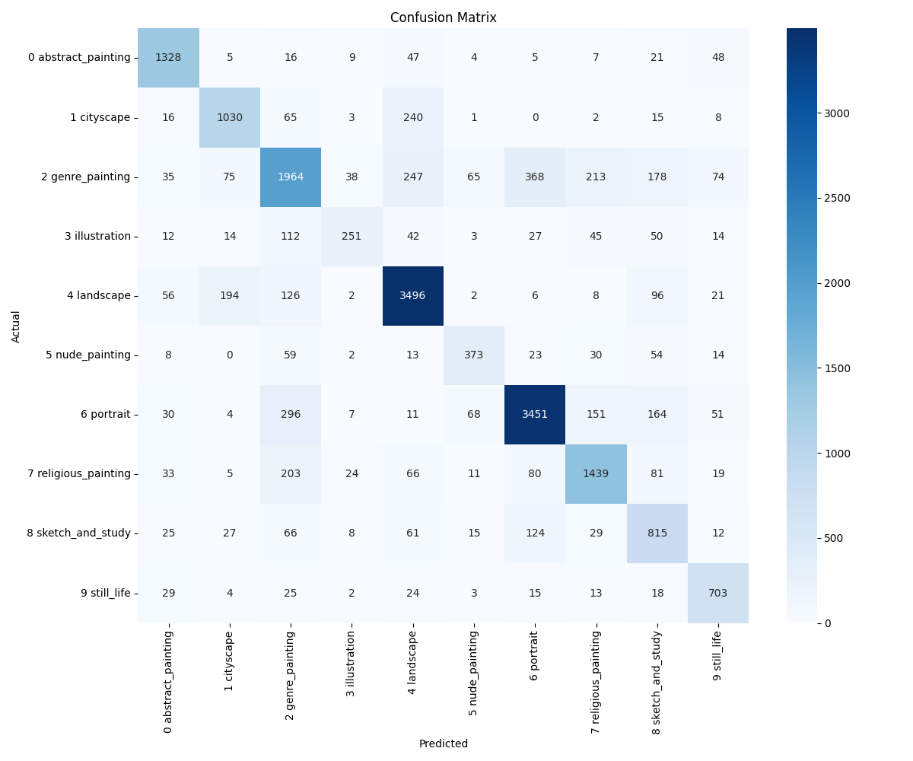
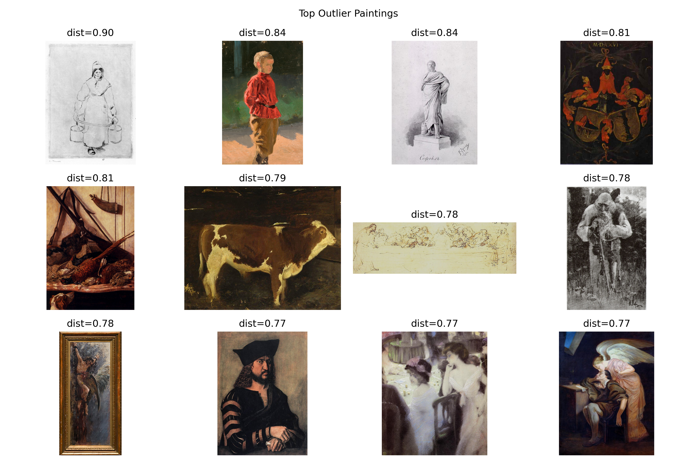

# crnn
This repository implements a Convolutional Recurrent Neural Network (CRNN) to classify artwork and extract rich visual embeddings. The architecture leverages a pre-trained **ResNet-50 backbone**, a **BiLSTM** for sequential feature processing, and **Attention Pooling** to generate robust representations of paintings.
Because the model generates high-quality intermediate embeddings, it is highly effective for transfer learning, t-SNE clustering, and anomaly/outlier detection using cosine similarity.

## Methodology
Initially, a full multi-task/multiclass approach was considered to predict artist, style, and genre simultaneously. However, to optimize computational efficiency and ensure the model captured high-level artistic nuances first, a staged approach was adopted:
 - Base Training: The CRNN was first trained specifically for Artist Classification. This allowed the model to develop a strong feature extractor (the CNN backbone + BiLSTM) capable of recognizing unique brushwork and compositional patterns.
 - Feature Reuse: The weights from this artist-centric model were then used as a foundation. By fine-tuning these weights for Genre and Style, the model converged much faster than training from scratch.

## Results

## Repository Structure
* `model.py` - Core PyTorch `ResNetBiLSTM` architecture.
* `artist_data.py` - Custom PyTorch Dataset for loading WikiArt images and CSV labels.
* `artist_train.py` - Base training script for artist classification.
* `transfer_train.py` - Transfer learning script to adapt the base model to new tasks (e.g., genre or style classification).
* `extract_embeddings.py` - Generates and saves `.npy` feature embeddings from the trained model.
* `visualize_embeddings.py` - Performs t-SNE dimensionality reduction for cluster visualization.
* `show_outliers.py` - Calculates cosine distance from class centroids to flag and plot anomalous paintings.
* `evaluate.py` - Runs validation, calculates accuracy, and generates a confusion matrix.

## Usage
### 1. Base Training (Artist Classification)
Train the model from scratch to classify artists. This will create a `checkpoints/best_model.pt` file.
### 2. Extracting Embeddings & Finding Similarities
Once the base model is trained, extract the dense embeddings to analyze the latent space.
 - python extract_embeddings.py
 - python visualize_embeddings.py
 - python show_outliers.py
### 3. Transfer Learning (Genre or Style Classification)
To train the model on a new task (like "genre"), the transfer learning script will load the base weights (excluding the old classifier head) to jumpstart training.
 - python transfer_train.py
### 4. Evaluation
Evaluate the fine-tuned model and generate a visual confusion matrix.
 - python evaluate.py

## 📄 Reference

Tan, W. R., Chan, C. S., Aguirre, H., & Tanaka, K. (2019).  
**Improved ArtGAN for Conditional Synthesis of Natural Image and Artwork**.  
*IEEE Transactions on Image Processing*, 28(1), 394–409.  
https://doi.org/10.1109/TIP.2018.2866698
